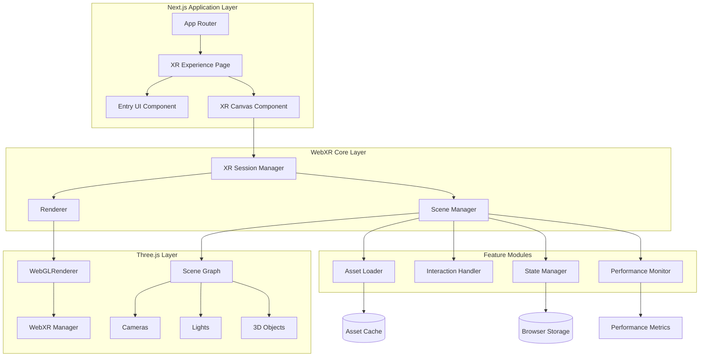
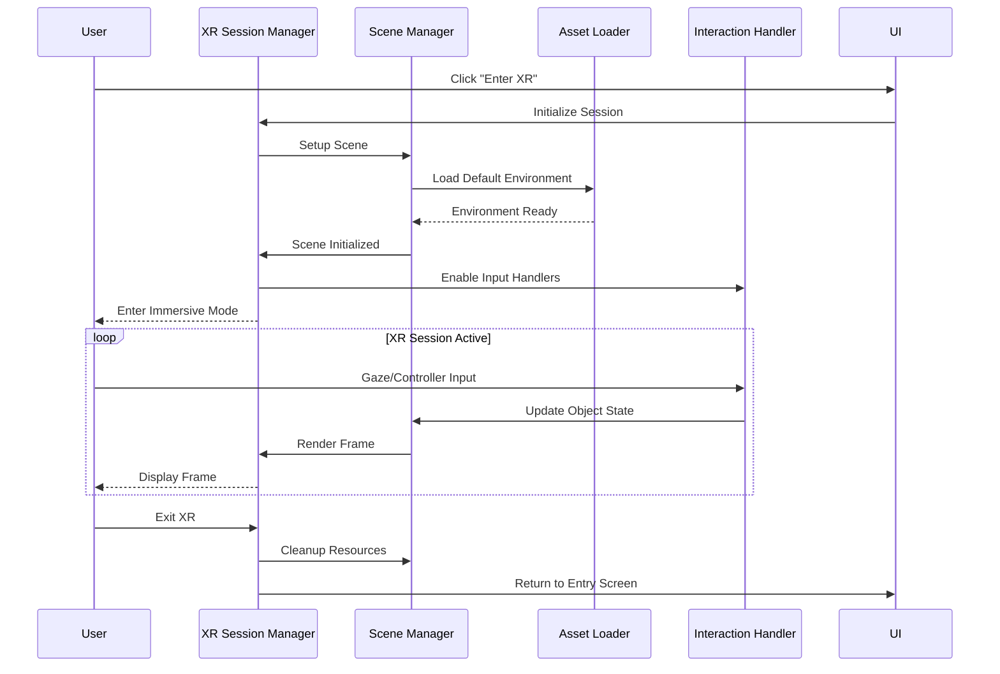

# WebXR Immersive Experience - Design Document

## Overview

This design document outlines the architecture for a browser-based immersive WebXR experience built on Next.js 16 with React 19 and TypeScript. The system leverages Three.js as the WebGL rendering engine and integrates WebXR Device API for immersive sessions. The architecture prioritizes modularity, performance, and rapid iteration for the Meta Horizon Developer Competition.


### Key Design Decisions

1. **Next.js with Client-Side Rendering**: WebXR requires browser APIs unavailable during SSR. We'll use Next.js client components with dynamic imports to ensure WebXR code only runs in the browser.

2. **Three.js as Rendering Engine**: Three.js provides robust WebXR support through `WebXRManager` and handles the complexity of WebGL rendering, scene graphs, and asset loading.

3. **Modular Architecture**: Separate concerns into distinct modules (Scene, Assets, Interaction, State) that communicate through well-defined interfaces.

4. **React for UI Layer**: Use React for 2D UI overlays (entry screen, loading states, error messages) while Three.js handles 3D rendering.

5. **TypeScript Strict Mode**: Leverage existing strict TypeScript configuration for type safety across all modules.

## Architecture

### High-Level Architecture Diagram



### Component Interaction Flow



## Components and Interfaces

### 1. XR Session Manager

**Responsibility**: Manages WebXR session lifecycle, device detection, and session mode selection.

**Interface**:
```typescript
interface XRSessionManager {
  // Check if WebXR is supported
  isXRSupported(): Promise<boolean>;
  
  // Get available session modes
  getSupportedModes(): Promise<XRSessionMode[]>;
  
  // Initialize XR session
  startSession(mode: XRSessionMode): Promise<XRSession>;
  
  // End current session
  endSession(): Promise<void>;
  
  // Get current session state
  getSessionState(): XRSessionState;
  
  // Register frame callback
  onFrame(callback: XRFrameCallback): void;
}

type XRSessionMode = 'immersive-vr' | 'immersive-ar' | 'inline';
type XRSessionState = 'idle' | 'initializing' | 'active' | 'ending' | 'error';
type XRFrameCallback = (time: number, frame: XRFrame) => void;
```

**Implementation Details**:
- Uses `navigator.xr.isSessionSupported()` for capability detection
- Wraps Three.js `WebGLRenderer.xr` for session management
- Implements error handling with fallback to inline mode
- Provides event emitters for session state changes

### 2. Scene Manager

**Responsibility**: Manages Three.js scene graph, cameras, lighting, and environment setup.

**Interface**:
```typescript
interface SceneManager {
  // Initialize scene with default environment
  initialize(): Promise<void>;
  
  // Add object to scene
  addObject(object: Object3D, config?: ObjectConfig): string;
  
  // Remove object from scene
  removeObject(id: string): void;
  
  // Get object by ID
  getObject(id: string): Object3D | null;
  
  // Update scene before render
  update(deltaTime: number): void;
  
  // Cleanup resources
  dispose(): void;
  
  // Get scene reference
  getScene(): Scene;
  
  // Get camera reference
  getCamera(): Camera;
}

interface ObjectConfig {
  position?: Vector3;
  rotation?: Euler;
  scale?: Vector3;
  interactive?: boolean;
  metadata?: Record<string, any>;
}
```

**Implementation Details**:
- Creates Three.js `Scene` with default lighting (ambient + directional)
- Manages `PerspectiveCamera` for non-XR and XR camera rig
- Implements object registry with UUID-based lookup
- Handles scene graph hierarchy and transformations
- Provides helper methods for common scene operations

### 3. Asset Loader

**Responsibility**: Loads, caches, and manages 3D models, textures, and other assets.

**Interface**:
```typescript
interface AssetLoader {
  // Load GLTF/GLB model
  loadModel(url: string, options?: LoadOptions): Promise<Group>;
  
  // Load texture
  loadTexture(url: string, options?: TextureOptions): Promise<Texture>;
  
  // Preload multiple assets
  preloadAssets(manifest: AssetManifest): Promise<LoadResult>;
  
  // Get cached asset
  getCached(url: string): Object3D | Texture | null;
  
  // Clear cache
  clearCache(): void;
  
  // Get loading progress
  getProgress(): LoadProgress;
}

interface LoadOptions {
  onProgress?: (progress: number) => void;
  fallbackUrl?: string;
  cache?: boolean;
}

interface AssetManifest {
  models: string[];
  textures: string[];
  priority?: 'high' | 'normal' | 'low';
}

interface LoadProgress {
  loaded: number;
  total: number;
  percentage: number;
  currentAsset: string;
}
```

**Implementation Details**:
- Uses Three.js `GLTFLoader` for model loading
- Implements `LoadingManager` for progress tracking
- Caches loaded assets in Map with URL keys
- Compresses textures based on device capabilities (WebGL extensions)
- Implements retry logic with exponential backoff
- Loads fallback assets on error

### 4. Interaction Handler

**Responsibility**: Processes user input from gaze, controllers, mouse, and touch.

**Interface**:
```typescript
interface InteractionHandler {
  // Initialize input handlers
  initialize(camera: Camera, scene: Scene): void;
  
  // Register interactive object
  registerObject(object: Object3D, handlers: InteractionHandlers): void;
  
  // Unregister object
  unregisterObject(object: Object3D): void;
  
  // Update interaction state (call per frame)
  update(frame?: XRFrame): void;
  
  // Enable/disable interaction
  setEnabled(enabled: boolean): void;
  
  // Get current interaction target
  getCurrentTarget(): Object3D | null;
}

interface InteractionHandlers {
  onHover?: (event: InteractionEvent) => void;
  onSelect?: (event: InteractionEvent) => void;
  onGaze?: (event: GazeEvent) => void;
  onGrab?: (event: GrabEvent) => void;
}

interface InteractionEvent {
  object: Object3D;
  point: Vector3;
  inputSource: 'gaze' | 'controller' | 'mouse' | 'touch';
  timestamp: number;
}

interface GazeEvent extends InteractionEvent {
  gazeDuration: number;
  gazeThreshold: number;
}
```

**Implementation Details**:
- Uses Three.js `Raycaster` for intersection detection
- Implements gaze timer (1.5s threshold) with visual feedback
- Handles XR controller input through `XRInputSource`
- Falls back to mouse/touch events for non-XR mode
- Provides visual feedback (highlight shader, cursor reticle)
- Prioritizes controller > gaze > mouse input

### 5. State Manager

**Responsibility**: Centralized state management with persistence and reactivity.

**Interface**:
```typescript
interface StateManager {
  // Get current state
  getState<T = any>(): T;
  
  // Update state
  setState(updates: Partial<AppState>): void;
  
  // Subscribe to state changes
  subscribe(listener: StateListener): () => void;
  
  // Persist state to storage
  persist(): Promise<void>;
  
  // Restore state from storage
  restore(): Promise<void>;
  
  // Reset to initial state
  reset(): void;
}

interface AppState {
  session: {
    mode: XRSessionMode | null;
    isActive: boolean;
  };
  scene: {
    loadingProgress: number;
    isReady: boolean;
  };
  user: {
    position: Vector3;
    rotation: Euler;
  };
  interactions: {
    currentTarget: string | null;
    lastAction: string | null;
  };
  performance: {
    fps: number;
    drawCalls: number;
    memoryUsage: number;
  };
}

type StateListener = (state: AppState, prevState: AppState) => void;
```

**Implementation Details**:
- Implements observer pattern for reactive updates
- Uses `localStorage` for persistence with JSON serialization
- Validates state updates against Zod schemas
- Batches updates to prevent excessive re-renders
- Provides React hook (`useXRState`) for component integration
- Implements time-travel debugging in development mode

### 6. Performance Monitor

**Responsibility**: Tracks performance metrics and implements adaptive quality.

**Interface**:
```typescript
interface PerformanceMonitor {
  // Start monitoring
  start(): void;
  
  // Stop monitoring
  stop(): void;
  
  // Get current metrics
  getMetrics(): PerformanceMetrics;
  
  // Register performance callback
  onMetricsUpdate(callback: MetricsCallback): () => void;
  
  // Enable adaptive quality
  setAdaptiveQuality(enabled: boolean): void;
}

interface PerformanceMetrics {
  fps: number;
  frameTime: number;
  drawCalls: number;
  triangles: number;
  textures: number;
  geometries: number;
  memoryUsage: number;
  timestamp: number;
}

type MetricsCallback = (metrics: PerformanceMetrics) => void;
```

**Implementation Details**:
- Uses `performance.now()` for high-resolution timing
- Tracks Three.js renderer stats (`renderer.info`)
- Implements FPS counter with rolling average (60 samples)
- Monitors memory usage through `performance.memory` (Chrome)
- Implements adaptive quality: reduces shadows, texture resolution, draw distance when FPS < 55
- Logs metrics to console in development mode

## Data Models

### Scene Object Model

```typescript
interface SceneObject {
  id: string;
  type: 'mesh' | 'group' | 'light' | 'camera';
  object3D: Object3D;
  metadata: {
    name: string;
    interactive: boolean;
    tags: string[];
    customData: Record<string, any>;
  };
  transform: {
    position: Vector3;
    rotation: Euler;
    scale: Vector3;
  };
  state: {
    visible: boolean;
    enabled: boolean;
    highlighted: boolean;
  };
}
```

### Asset Model

```typescript
interface Asset {
  id: string;
  url: string;
  type: 'model' | 'texture' | 'audio';
  status: 'pending' | 'loading' | 'loaded' | 'error';
  data: Object3D | Texture | AudioBuffer | null;
  metadata: {
    size: number;
    loadTime: number;
    cached: boolean;
  };
  error?: Error;
}
```

### Input State Model

```typescript
interface InputState {
  gaze: {
    target: Object3D | null;
    duration: number;
    active: boolean;
  };
  controllers: {
    left: ControllerState | null;
    right: ControllerState | null;
  };
  mouse: {
    position: Vector2;
    buttons: number;
  };
  touch: {
    touches: TouchPoint[];
  };
}

interface ControllerState {
  connected: boolean;
  position: Vector3;
  rotation: Quaternion;
  buttons: ButtonState[];
  axes: number[];
  hapticActuator: GamepadHapticActuator | null;
}
```

## Error Handling

### Error Categories

1. **Session Errors**: WebXR not supported, session request denied
2. **Asset Errors**: Failed to load models/textures, invalid format
3. **Rendering Errors**: WebGL context lost, shader compilation failed
4. **Performance Errors**: FPS too low, memory exhausted

### Error Handling Strategy

```typescript
class XRError extends Error {
  constructor(
    message: string,
    public category: ErrorCategory,
    public recoverable: boolean,
    public userMessage: string
  ) {
    super(message);
  }
}

type ErrorCategory = 'session' | 'asset' | 'rendering' | 'performance';

// Error handling flow
try {
  await sessionManager.startSession('immersive-vr');
} catch (error) {
  if (error instanceof XRError) {
    // Log technical details
    console.error(error);
    
    // Show user-friendly message
    showErrorUI(error.userMessage);
    
    // Attempt recovery if possible
    if (error.recoverable) {
      await attemptRecovery(error);
    }
  }
}
```

### Fallback Strategy

1. **XR Not Supported**: Fall back to inline 3D viewer with mouse controls
2. **Asset Load Failure**: Use placeholder geometry (cube/sphere) with solid color
3. **WebGL Context Lost**: Attempt context restoration, reload page if fails
4. **Low Performance**: Reduce quality settings, disable effects

## Testing Strategy

### Unit Testing

**Tools**: Vitest, @testing-library/react

**Coverage**:
- State Manager: State updates, persistence, validation
- Asset Loader: Caching logic, error handling, progress tracking
- Interaction Handler: Input prioritization, event dispatching
- Performance Monitor: Metrics calculation, adaptive quality logic

**Example Test**:
```typescript
describe('StateManager', () => {
  it('should notify subscribers on state change', () => {
    const manager = new StateManager();
    const listener = vi.fn();
    
    manager.subscribe(listener);
    manager.setState({ scene: { isReady: true } });
    
    expect(listener).toHaveBeenCalledWith(
      expect.objectContaining({ scene: { isReady: true } }),
      expect.any(Object)
    );
  });
});
```

### Integration Testing

**Tools**: Playwright, WebXR Emulator

**Coverage**:
- XR session initialization flow
- Asset loading and scene setup
- User interaction workflows
- Error handling and recovery

**Example Test**:
```typescript
test('should initialize XR session and load scene', async ({ page }) => {
  await page.goto('/xr-experience');
  
  // Click enter XR button
  await page.click('[data-testid="enter-xr"]');
  
  // Wait for scene to load
  await page.waitForSelector('[data-testid="xr-canvas"]');
  
  // Verify session is active
  const sessionState = await page.evaluate(() => {
    return window.__XR_SESSION_STATE__;
  });
  
  expect(sessionState).toBe('active');
});
```

### Manual Testing

**Devices**:
- Meta Quest 2/3 (primary target)
- Desktop browser with WebXR emulator
- Mobile browser (fallback mode)

**Test Scenarios**:
- Enter/exit XR session
- Interact with objects using gaze
- Interact with objects using controllers
- Test performance under load
- Test error scenarios (disconnect headset, network failure)

## Technology Stack

### Core Dependencies

```json
{
  "dependencies": {
    "three": "^0.160.0",
    "@react-three/fiber": "^8.15.0",
    "@react-three/drei": "^9.92.0",
    "zustand": "^4.4.7",
    "zod": "^3.22.4"
  },
  "devDependencies": {
    "vitest": "^1.0.4",
    "@testing-library/react": "^14.1.2",
    "playwright": "^1.40.1"
  }
}
```

### Library Justifications

1. **Three.js**: Industry-standard WebGL library with excellent WebXR support
2. **@react-three/fiber**: React renderer for Three.js, enables declarative 3D scenes
3. **@react-three/drei**: Helper components for common Three.js patterns
4. **Zustand**: Lightweight state management, simpler than Redux
5. **Zod**: Runtime type validation for state and API responses

## Project Structure

```
src/
├── app/
│   ├── layout.tsx                 # Root layout
│   ├── page.tsx                   # Landing page
│   └── xr/
│       └── page.tsx               # XR experience page
├── components/
│   ├── ui/
│   │   ├── EntryScreen.tsx        # XR entry UI
│   │   ├── LoadingOverlay.tsx     # Loading indicator
│   │   └── ErrorBoundary.tsx      # Error handling UI
│   └── xr/
│       ├── XRCanvas.tsx           # Main XR canvas component
│       ├── XRScene.tsx            # Scene setup component
│       └── XRControls.tsx         # Input controls component
├── lib/
│   ├── xr/
│   │   ├── session-manager.ts     # XR session management
│   │   ├── scene-manager.ts       # Scene management
│   │   ├── asset-loader.ts        # Asset loading
│   │   ├── interaction-handler.ts # Input handling
│   │   ├── performance-monitor.ts # Performance tracking
│   │   └── types.ts               # TypeScript types
│   ├── state/
│   │   ├── store.ts               # Zustand store
│   │   ├── hooks.ts               # React hooks
│   │   └── schemas.ts             # Zod schemas
│   └── utils/
│       ├── three-helpers.ts       # Three.js utilities
│       └── webxr-helpers.ts       # WebXR utilities
├── public/
│   └── assets/
│       ├── models/                # 3D models
│       ├── textures/              # Textures
│       └── audio/                 # Audio files
└── tests/
    ├── unit/                      # Unit tests
    ├── integration/               # Integration tests
    └── setup.ts                   # Test configuration
```

## Performance Optimization

### Rendering Optimizations

1. **Frustum Culling**: Automatically handled by Three.js
2. **Level of Detail (LOD)**: Use `THREE.LOD` for distant objects
3. **Instanced Rendering**: Use `InstancedMesh` for repeated objects
4. **Texture Compression**: Use KTX2/Basis Universal for smaller textures
5. **Geometry Merging**: Combine static meshes to reduce draw calls

### Asset Optimization

1. **Model Optimization**: Use Draco compression for GLTF models
2. **Texture Atlasing**: Combine multiple textures into atlases
3. **Lazy Loading**: Load assets on-demand, not all at startup
4. **Progressive Loading**: Load low-res first, then high-res
5. **Asset Bundling**: Bundle small assets to reduce HTTP requests

### Code Optimization

1. **Tree Shaking**: Next.js automatically removes unused code
2. **Code Splitting**: Dynamic imports for XR-specific code
3. **Memoization**: Use React.memo and useMemo for expensive computations
4. **Web Workers**: Offload heavy computations (not in initial scope)

## Deployment Strategy

### Build Configuration

```javascript
// next.config.js
module.exports = {
  output: 'export', // Static export for GitHub Pages
  images: {
    unoptimized: true // Required for static export
  },
  webpack: (config) => {
    // Optimize for WebXR
    config.resolve.alias = {
      ...config.resolve.alias,
      'three': 'three/build/three.module.js'
    };
    return config;
  }
};
```

### Deployment Targets

1. **Vercel** (Recommended):
   - Automatic HTTPS
   - Edge network for fast loading
   - Preview deployments for each commit
   - Command: `vercel deploy`

2. **GitHub Pages**:
   - Free hosting
   - Custom domain support
   - Requires static export
   - Command: `npm run build && gh-pages -d out`

3. **Cloudflare Pages**:
   - Fast global CDN
   - Automatic builds from Git
   - Free SSL
   - Connect via Cloudflare dashboard

### Environment Configuration

```typescript
// src/lib/config.ts
export const config = {
  isDevelopment: process.env.NODE_ENV === 'development',
  baseUrl: process.env.NEXT_PUBLIC_BASE_URL || '',
  assetPath: process.env.NEXT_PUBLIC_ASSET_PATH || '/assets',
  enableDebug: process.env.NEXT_PUBLIC_DEBUG === 'true',
  performanceMonitoring: process.env.NEXT_PUBLIC_PERF_MONITOR === 'true'
};
```

## Development Workflow

### Local Development

1. **Start dev server**: `npm run dev`
2. **Enable HTTPS**: Use `mkcert` for local SSL certificates (required for WebXR)
3. **Use WebXR Emulator**: Install browser extension for desktop testing
4. **Hot reload**: Changes reflect immediately without full page reload

### Testing Workflow

1. **Run unit tests**: `npm run test`
2. **Run integration tests**: `npm run test:e2e`
3. **Test on device**: Use ngrok or similar to expose local server
4. **Performance profiling**: Use Chrome DevTools Performance tab

### Git Workflow

1. **Feature branches**: Create branch for each feature
2. **Commit conventions**: Use conventional commits (feat:, fix:, docs:)
3. **Pull requests**: Require review before merge
4. **CI/CD**: Automatic tests and deployment on merge

## Security Considerations

1. **HTTPS Required**: WebXR APIs only available over HTTPS
2. **Content Security Policy**: Configure CSP headers for asset loading
3. **CORS**: Ensure assets are served with proper CORS headers
4. **Input Validation**: Validate all user input and state updates
5. **Dependency Auditing**: Regular `npm audit` to check for vulnerabilities

## Accessibility

1. **Keyboard Navigation**: Support keyboard controls for non-XR mode
2. **Screen Reader**: Provide ARIA labels for UI elements
3. **Motion Sensitivity**: Provide option to reduce motion/effects
4. **Color Contrast**: Ensure UI meets WCAG AA standards
5. **Alternative Text**: Describe 3D content for screen readers

## Future Enhancements

1. **Multiplayer**: WebRTC for real-time collaboration
2. **Hand Tracking**: Support for hand tracking input
3. **Spatial Audio**: 3D positional audio
4. **Physics Engine**: Cannon.js or Rapier for realistic physics
5. **AI Integration**: LLM-powered NPCs or voice commands
articipant UI as Entry UI
    p